# 基于瑞萨 RA8D1 的端云协同多模态阅读点阵与智能交互系统

> 一块会"摸"的屏幕：把文字变成盲文点阵，把隐私留在本地，把复杂认知交给云端。

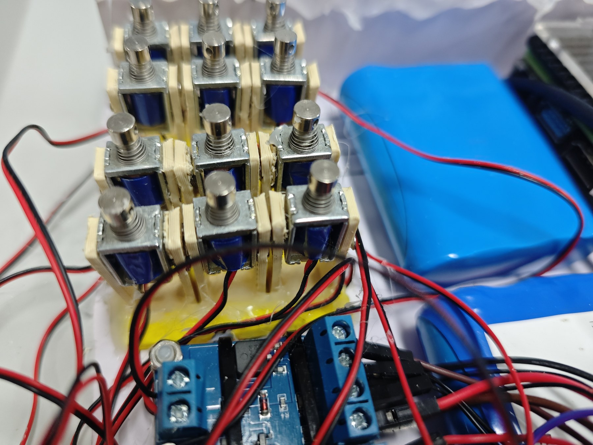

我国有超过 1700 万视障群体，日常居家盲文学习、隐私信息读取与智能交互中长期存在信息壁垒。现有辅助设备多以单一语音播报为主——既无法培养盲文读写能力，又在处理银行账单、医疗单据等敏感信息时存在上云泄露风险，且大多未接入大模型。

本作品以 **瑞萨 RA8D1** 为核心调度中枢，构建了一套"**端侧保隐私、云端强认知**"的分级协同系统：端侧在本地完成 OCR 与手势识别，隐私数据零外流；云端按需调用大模型完成深度语义理解与多模态问答。

> **仓库范围**：本仓库仅包含 **RA8D1 主控端固件**（瑞萨 FSP / e² studio 工程）。
> 树莓派边缘端（本地 OCR、TFLite 手势推理）与云端平台（大模型调用、学习看板）**不在本仓库内** ——
> 这两部分实现逻辑相对直接，读者可依据下文[通信协议](#通信协议)自行实现。
> 与它们对接的帧协议、状态机与数据流，本仓库已完整定义并实现。

---

## 目录

- [系统架构](#系统架构)
- [核心特性](#核心特性)
- [硬件设计](#硬件设计)
- [固件设计](#固件设计)
- [通信协议](#通信协议)
- [快速开始](#快速开始)
- [性能指标](#性能指标)
- [工程结构](#工程结构)
- [关键技术难点](#关键技术难点)
- [后续可扩展方向](#后续可扩展方向)

---

## 系统架构

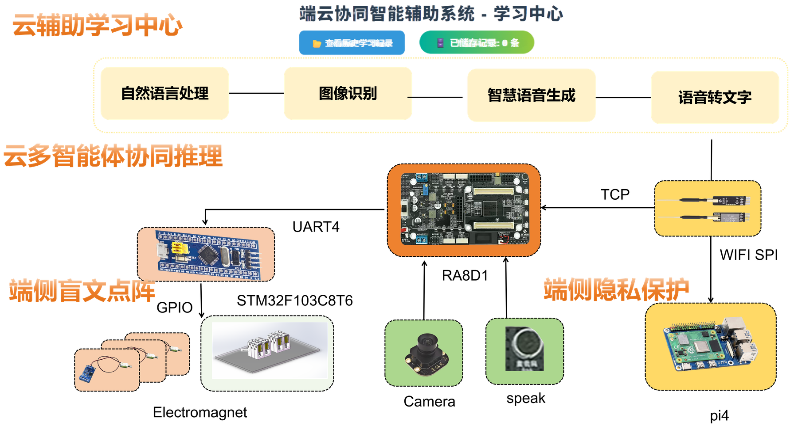

系统采用端—边—云三级协同：

| 层级 | 平台 | 职责 |
| --- | --- | --- |
| **端**（触觉执行） | RA8D1 + STM32F103 | 图像/语音采集、状态机调度、盲文点阵驱动 |
| **边**（隐私计算） | 树莓派 4B | 本地 Tesseract OCR、TFLite 手势推理 |
| **云**（认知增强） | 百度千帆 + FastAPI | ASR / LLM / 图文理解 / TTS，学习数据可视化 |

数据流：RA8D1 通过 **DVP/CEU** 采集 MT9V03X 摄像头图像，经 **SPI 高速 WiFi6 模块** 送至树莓派；树莓派在本地完成识别或转发云端，结果回传 RA8D1 后，经 **UART** 下发 STM32 驱动电磁铁阵列，还原为可触摸的盲文点阵。

---

## 核心特性

### 1. 端侧智能控制与隐私保护
- **本地 OCR 实时识别**：不联外网即可识别文字，隐私数据不上云
- **盲文点阵精准交互**：识别文本实时映射为标准盲文点阵，支持触觉阅读与盲文学习
- **手势智能控制**：非接触式手势（石头/剪刀/布）实现点阵回放与节奏控制

### 2. 云端智能体协同
- **多智能体链路**：ASR 语音转写 → LLM 意图识别 → Entire 5.0 图文理解 → TTS 语音合成
- **学习辅助中心**：交互数据经授权归档，AI 动态提取阅读关键词生成可视化词云

### 3. 多模态融合
视觉（摄像头）· 听觉（麦克风/扬声器）· 触觉（电磁铁点阵）三位一体，既能在静音场景下触觉阅读，也能无缝切入大模型语音对话。

---

## 硬件设计

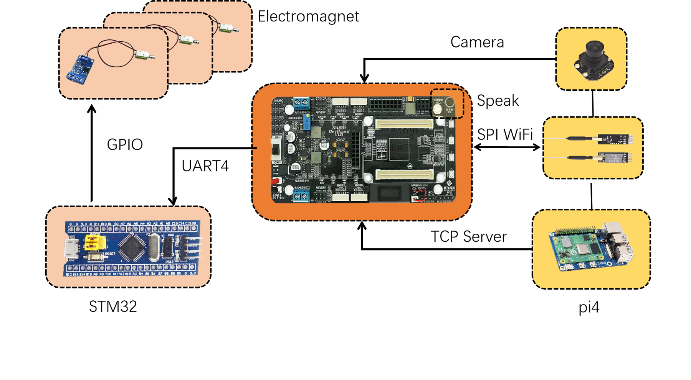

### 主要器件

| 模块 | 型号 | 接口 | 说明 |
| --- | --- | --- | --- |
| 主控 | 瑞萨 R7FA8D1AHECBD | — | Cortex-M85 + CM33 双核，系统调度中枢 |
| 摄像头 | MT9V03X 总钻风灰度 | DVP / CEU | 图像采集，采用 CEU Data Fetch Mode |
| 通信模块 | 逐飞 高速 WiFi6 B21-SPI V2.0 | SPI | 与树莓派建立 TCP 链路 |
| 执行端 | STM32F103C8T6 | UART | 盲文点阵与 OLED 显示控制 |
| 执行机构 | 12 路微型电磁铁 | GPIO → 驱动板 | 两组 3×2 点阵 |
| 音频 | 驻极体麦克风 / 扬声器 | ADC / DAC | 8 kHz 采样 |

### RA8D1 引脚分配

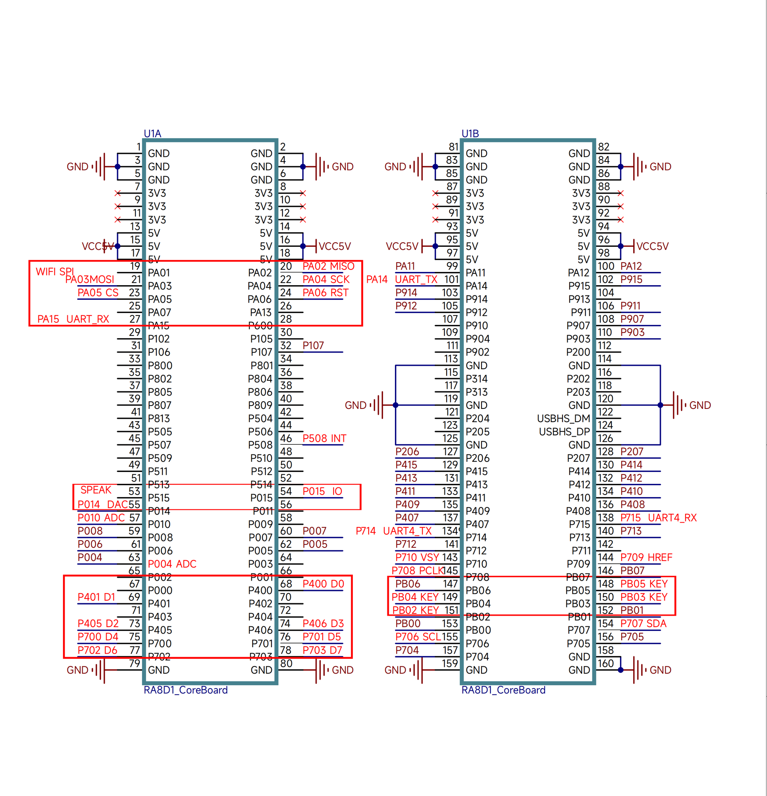

### 交互外设

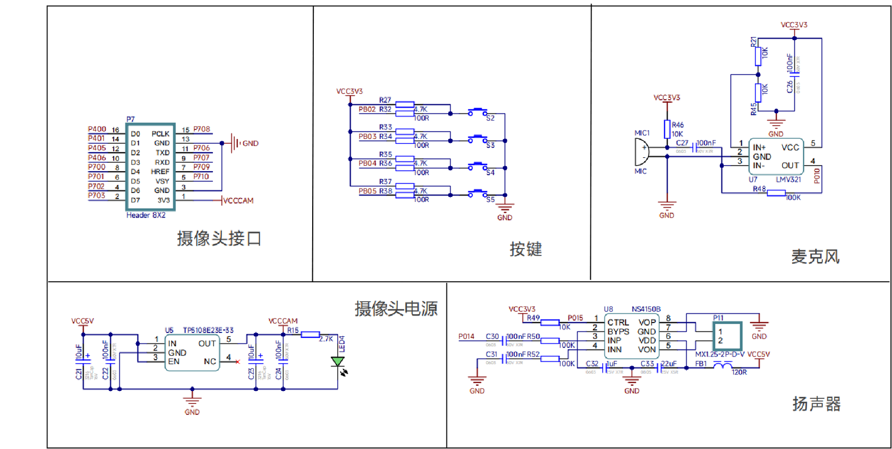

按键采用极简三键设计，其余功能交由手势完成，降低视障用户寻找按键的负担。

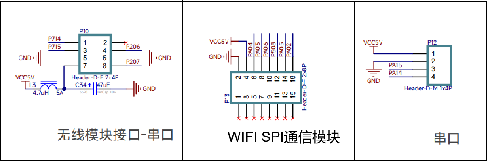

### 盲文点阵与驱动

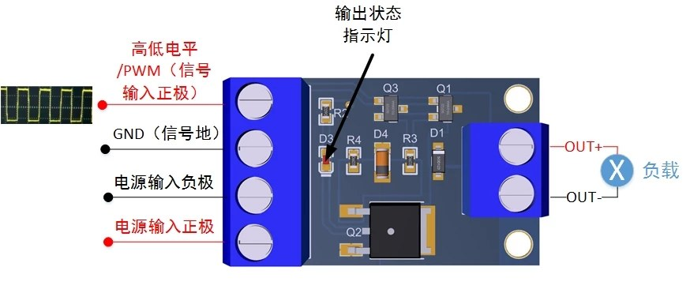

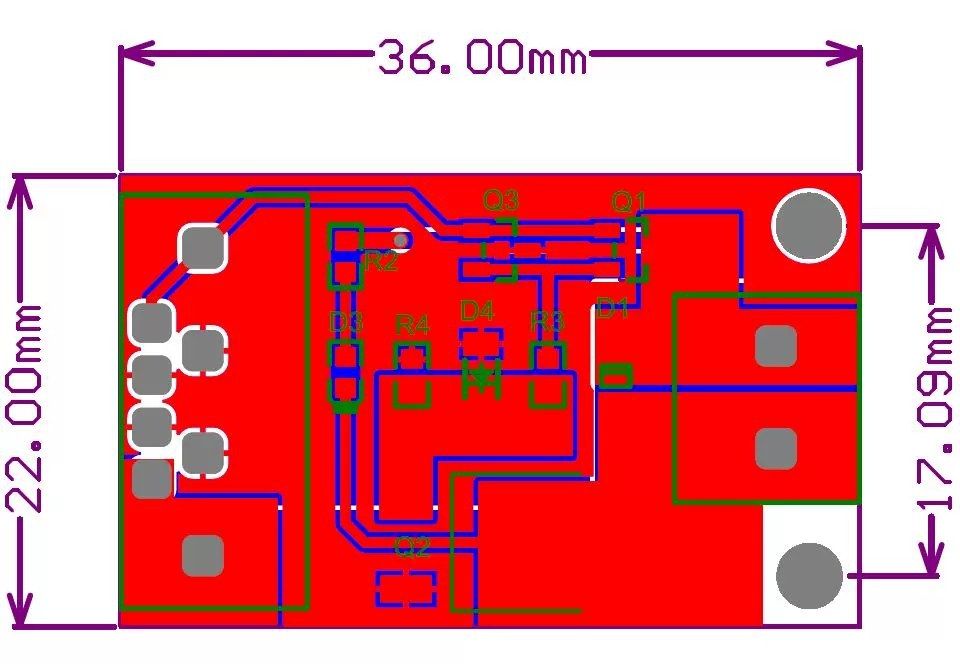

每个电磁铁额定 6 V，由 XL4016E1 降压模块从 12 V 锂电池独立供电，GPIO 直接接入驱动板 PWM 口实现快速升降。

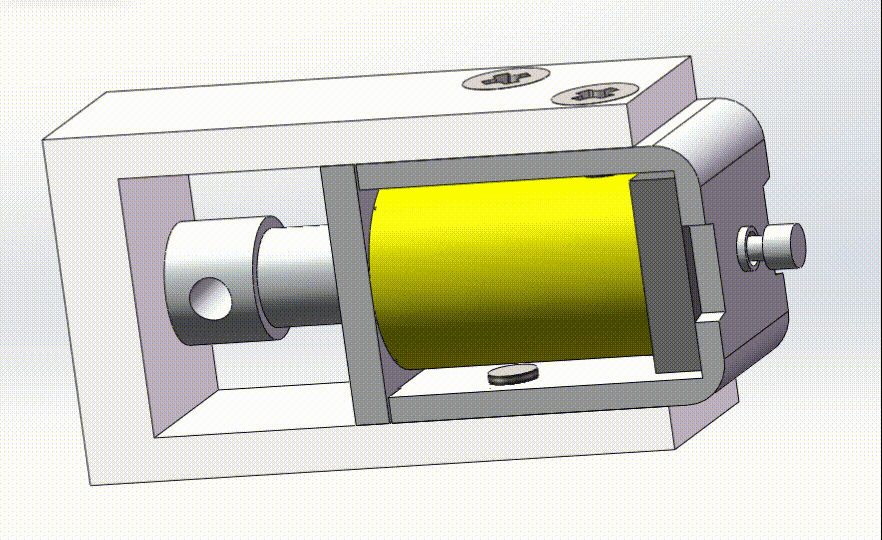

### 边缘计算平台

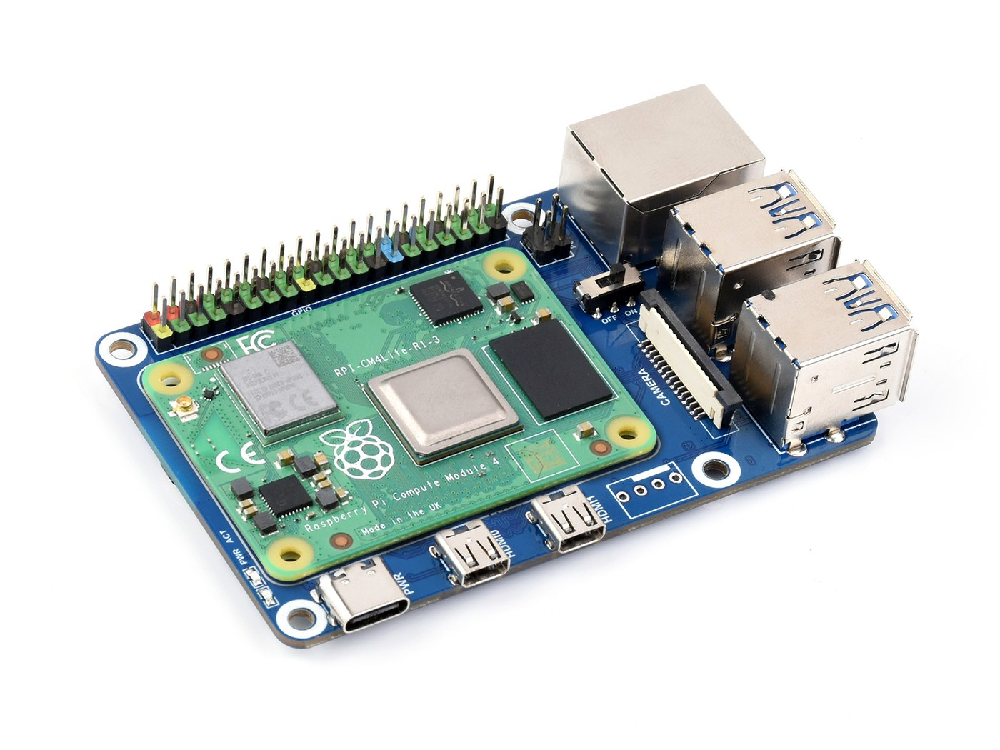

树莓派 4B 承担双重角色：既是本地 AI 推理中枢（Tesseract OCR + TFLite 手势识别），也是云端 API 的中转站，缓解 RA8D1 的算力载荷。

### STM32 执行端

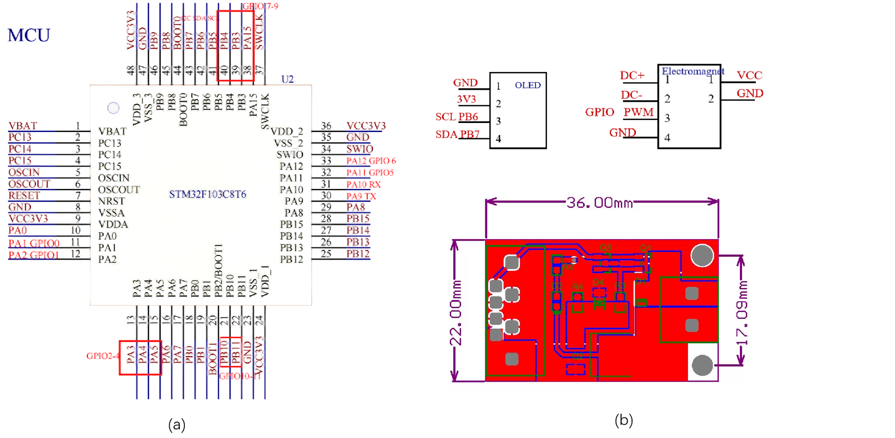

STM32F103 固化盲文查找表，支持 UTF-8 汉字解析与 GB/T 15720 标准点阵映射，通过行缓冲与超时机制接收 RA8D1 下发的文本流。

---

## 固件设计

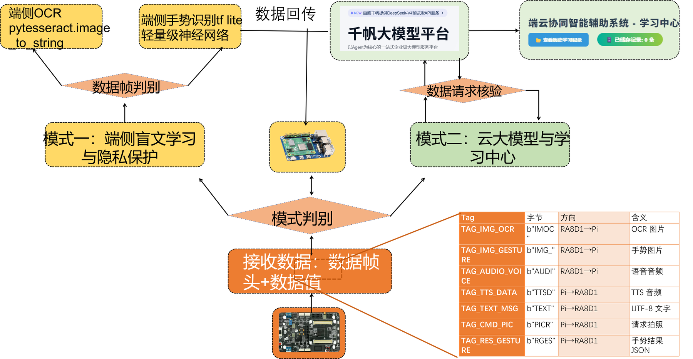

主控固件采用**前后台系统架构**，核心是基于双模态的状态机调度（[`src/hal_entry.c`](src/hal_entry.c)）。

### 双模式状态机

系统驻留于 `IDLE` 态，通过全局变量 `g_big_mode` 在两个功能域间切换：

#### 模式一：端侧处理（`MODE_PROCESS`）— 隐私保护 + 盲文实感学习

```
IDLE ──KEY-B──> M1_OCR_SNAP ──SPI 发图──> 树莓派 OCR ──TEXT_MSG──> M1_OCR_ACT ──UART──> STM32 点阵
IDLE ──KEY-C──> M1_GESTURE_SNAP ──SPI 发图──> 树莓派手势 ──RES_GESTURE──> M1_GESTURE_ACT ──UART──> STM32
```

#### 模式二：云端交互（`MODE_CLOUD`）— 大模型语音问答

```
IDLE ──KEY-B──> M2_RECORDING ──KEY-B 停止──> M2_WAIT_CLOUD
   ├── TTSD（纯语音回复）──────────────────────> 播放语音 ──> IDLE
   └── PICR（云端需要图像）──> M2_SNAP_PIC ──IMMU──> M2_WAIT_FINAL ──TTSD──> IDLE
```

### 按键定义

| 按键 | 模式一（端侧） | 模式二（云端） |
| --- | --- | --- |
| `KEY1` | 切换大模式 | 切换大模式 |
| `KEY2` | 触发 OCR 识别 | 开始 / 停止录音 |
| `KEY3` | 触发手势识别 | — |

### 音频处理

- **录音**：`adc_get_mic()` 以 125 µs 间隔采样（8 kHz），最长 48000 采样点（6 秒）
- **播放**：`dac_out()` 回放云端 TTS 音频流或本地提示音
- **本地提示音**：`src/wait_audio.h` 内嵌 8000 Hz 采样、2 秒时长的"正在上传到云端"提示音，避免等待期静默

---

## 通信协议

RA8D1 与树莓派之间采用轻量级私有帧协议：

```
┌────────────┬──────────────┬─────────────────────┐
│  Tag (4B)  │ Length (4B)  │     Payload (N B)   │
│   ASCII    │  Big-Endian  │                     │
└────────────┴──────────────┴─────────────────────┘
```

### 帧标签

| Tag | 方向 | 含义 |
| --- | --- | --- |
| `IMOC` | RA8D1 → Pi | OCR 用图像帧 |
| `IMG_` | RA8D1 → Pi | 手势识别用图像帧 |
| `IMMU` | RA8D1 → Pi | 云端多模态图像帧 |
| `AUDI` | RA8D1 → Pi | 语音流（PCM） |
| `TEXT` | Pi → RA8D1 | OCR 文本结果 |
| `RGES` | Pi → RA8D1 | 手势识别结果 |
| `PICR` | Pi → RA8D1 | 云端请求拍照 |
| `TTSD` | Pi → RA8D1 | TTS 语音数据 |

### 结果解析

- **OCR 结果**：从 JSON `"texts":["..."]` 中提取首个文本字段
- **手势结果**：从 JSON `"gesture_label":"..."` 解析，映射为 STM32 指令
  - `rock` → `1`，`paper` → `2`，`scissors` → `3`，`_unknown_` → `0`

### UART 直发优化

代码通过宏 `UART4_WRITE` 绕过 WiFi 协议栈的 AT 指令封装，直接操作 UART4 硬件发送，并以 `uart_send_complete_flag` 等待发送完成，避免连续 `write` 相互覆盖：

```c
#define UART4_WRITE(buf, len)                                     \
    do {                                                          \
        uart_send_complete_flag = false;                          \
        U4->p_api->write(U4->p_ctrl, (uint8_t const *)(buf), (uint32_t)(len)); \
        while(!uart_send_complete_flag);                          \
    } while(0)
```

---

## 快速开始

### 环境要求

- **瑞萨 e² studio**（含 FSP）
- **RA8D1 开发板**（R7FA8D1AHECBD）
- 串口调试工具（查看 `debug_write_buffer` 输出）

### 配置网络参数

烧录前请修改 [`src/hal_entry.c`](src/hal_entry.c) 顶部的 WiFi 配置：

```c
#define WIFI_SSID_TEST          "YOUR_WIFI_SSID"      // 你的 WiFi 名称
#define WIFI_PASSWORD_TEST      "YOUR_WIFI_PASSWORD"  // 你的 WiFi 密码
#define TARGET_IP               "192.168.1.100"       // 树莓派（边缘网关）IP
#define TARGET_PORT             "8888"                // 树莓派 TCP Server 端口
#define LOCAL_PORT              "8080"                // RA8D1 本地端口
```

> RA8D1 与树莓派须处于同一局域网；树莓派需先启动 TCP Server 监听 `TARGET_PORT`。

### 编译与烧录

1. 使用 e² studio 打开工程根目录（`.project` / `.cproject` 已包含）
2. FSP 配置位于 `configuration.xml`，如需调整引脚或外设可在此修改并重新生成
3. 构建并烧录至 RA8D1

### 上电流程

```
init_sdram() → debug_init() → wifi_uart_init() (UART4 → STM32)
            → wifi_spi_init() + socket_connect() (SPI → 树莓派)
            → mt9v03x_init() (摄像头)
            → adc_init() / dac_init() (音频)
            → 进入主循环
```

---

## 性能指标

| 指标 | 数值 |
| --- | --- |
| 额定工作电压 | 12 V |
| 最大工作电流 | 12 A |
| 静息功耗 | < 5 W |
| 持续工作时间 | > 3 h |
| 端侧处理速度 | < 2 s |
| 部件主体尺寸 | 321 × 225 × 32 mm |

### 分级响应时延

| 场景 | 时延 | 说明 |
| --- | --- | --- |
| 端侧极速响应 | < 1 s | 本地 OCR / 手势识别闭环 |
| 云端语音交互 | ≈ 3 s | ASR + LLM + TTS 端到端 |
| 多模态深度理解 | > 5 s | 云端 Entire 5.0 图文解析 |

---

## 工程结构

```
.
├── src/
│   ├── hal_entry.c          # 主应用：双模式状态机、帧协议、外设调度
│   └── wait_audio.h         # 内嵌提示音采样（8 kHz / 2 s）
├── ra/                      # 瑞萨 FSP 源码（BSP、HAL 驱动、CMSIS）
├── ra_gen/                  # FSP 生成的初始化代码（引脚、时钟、外设）
├── ra_cfg/                  # FSP 配置
├── zf_libraries/            # 逐飞科技开源库（摄像头、WiFi、DAC、按键等）
├── docs/images/             # README 配图
├── configuration.xml        # FSP 图形化配置
├── .cproject / .project     # e² studio 工程文件
└── script/                  # 链接脚本
```

### 依赖的外部模块

- **zf_libraries**：`zf_device_mt9v03x`（摄像头）、`zf_device_wifi_spi`（SPI WiFi）、`zf_device_wifi_uart`（UART 通信）、`zf_driver_dac` / `zf_driver_adc`（音频）、`zf_driver_gpio`（按键）
- **瑞萨 FSP**：`r_ceu`（图像采集）、`r_sci_uart`、`r_spi`、`r_adc`、`r_dac`

---

## 关键技术难点

### 1. 摄像头采集：从标准 DCMI 转向 CEU Data Fetch Mode

MT9V03X 输出标准 DCMI 时序（VSYNC/HSYNC/PCLK/8bit Data），RA8D1 内部也集成了对应的 CEU 外设。但受传感器特定时钟配置与信号极性影响，标准 DCMI 模式下 CEU 频繁报同步错误。

最终改用 CEU 的 **Data Fetch Mode**：预设图像尺寸，让 CEU 忽略复杂协议状态机，直接从数据总线连续抓取指定字节。牺牲了部分理论时序严谨性，换来图像采集的绝对稳定——**工程落地优于理论完美**。

### 2. 功率驱动：从杜邦线到定制 PCB

初期使用普通杜邦线连接驱动电路，大电流持续通过时导线严重发热甚至熔化。重新审视安培定律与焦耳定律后：

- 换用截面积更大的铜导线
- 重新设计 12 V / 5 V 电源隔离与滤波电路
- 采用定制驱动 PCB，GPIO 直接接入 PWM 口

### 3. 端侧 AI 鲁棒性：从"调库"到"写算法"

针对摄像头分辨率低、光照不均的问题，在树莓派端设计了：

- **OCR 多参数模板匹配**：对比度增强与自适应二值化预处理
- **手势多角度投票判决**：ROI 区域多角度推理投票，提升识别稳定性

---

## 后续可扩展方向

**硬件层面**
- 升级高分辨率全局快门摄像头，扩大 OCR 识别范围
- 电磁铁驱动接口标准化，可平滑替换为压电陶瓷或微针点阵等新型触觉执行器
- 外挂 SPI Flash 存储完整国标 GB/T 15720 盲文字库，摆脱实时联网查表

**应用层面**
- 从少字识别演进为段落级阅读，增加流式传输与盲文缓存，实现逐行点显
- 结合云端数据归档，扩展学习进度跟踪与个性化推荐

---

## 相关文档

完整作品报告与云端平台界面：

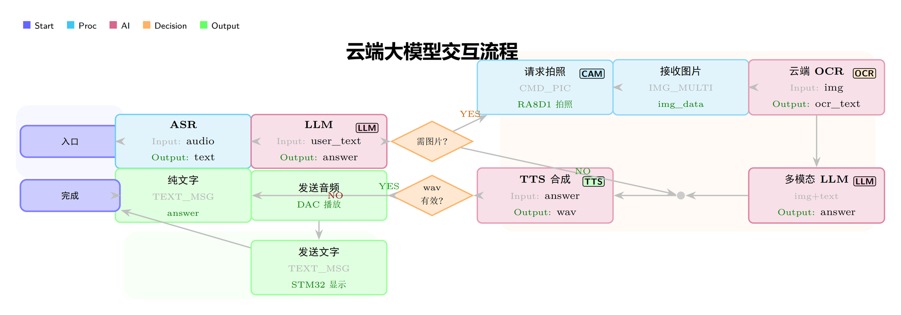

---

## 声明

本项目为**嵌入式芯片与系统设计大赛**参赛作品，仅用于学习与研究交流。

第三方库版权归各自所有者所有：瑞萨 FSP 源码遵循其原有许可，逐飞科技开源库版权归成都逐飞科技有限公司所有。
